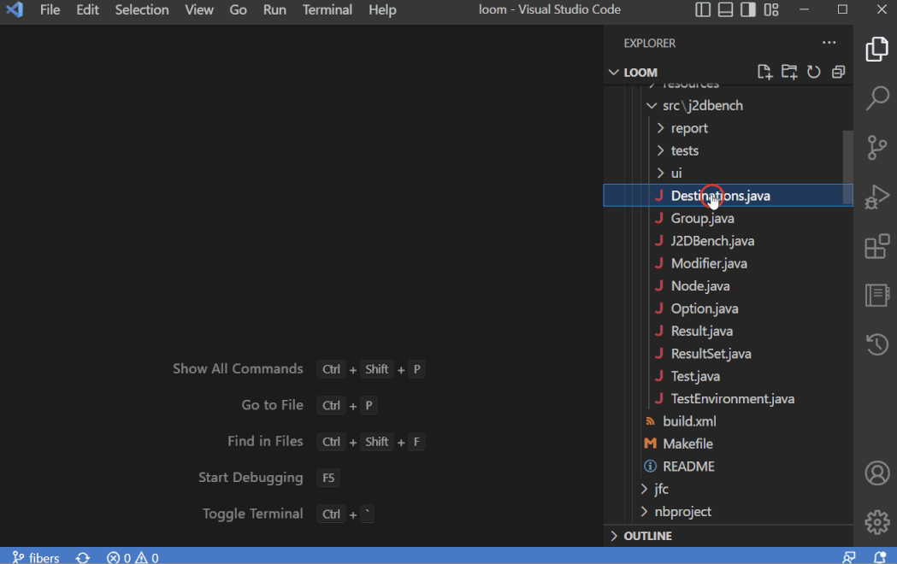

# Hide Top Comment

This extension hides the comment block on top of the file when it's opened. This can be useful if you want to focus on the code itself, or if you have long comments at the top of your files that take up a lot of space. 

## Extension Settings

The following configuration options are available:

* `languages`: Languages that the extension will work. Supported languages: `C,C++,C#,CSS,Go,Java,JavaScript,JSX,Kotlin,Python,Rust,Scala,TypeScript,TSX`
* `delay`: The delay, in milliseconds, before the comments are folded when file is opened. It can be between 0 and 1000 milliseconds.

To change the configuration options, open the Settings editor (Ctrl+Comma or F1) and search for "Hide Top Comment".

## Known Issues
None

## Release Notes
### 0.0.4
Update npm packages.

### 0.0.3
Added JSX and TSX.

### 0.0.2
Added CSS.

### 0.0.1
Initial release.

**Enjoy!**
